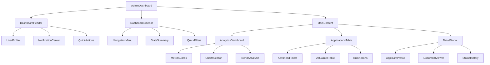
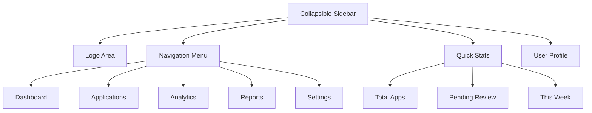
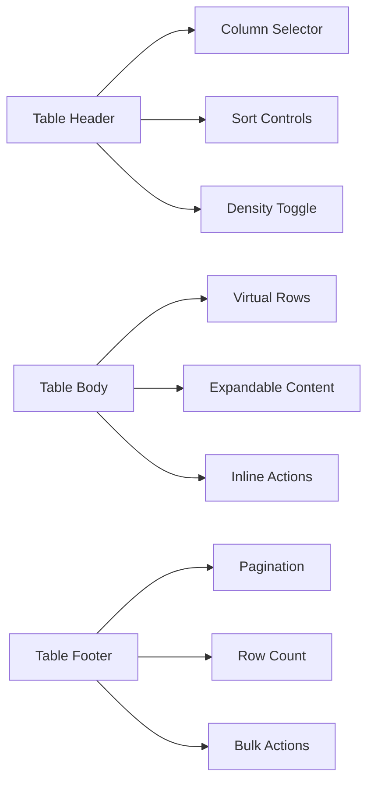
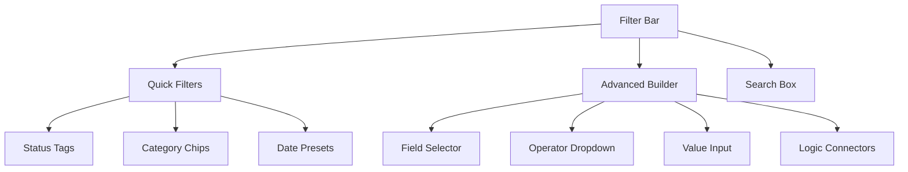
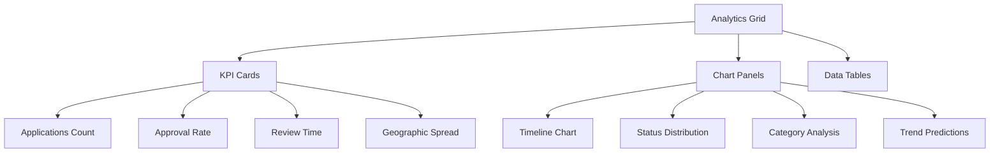
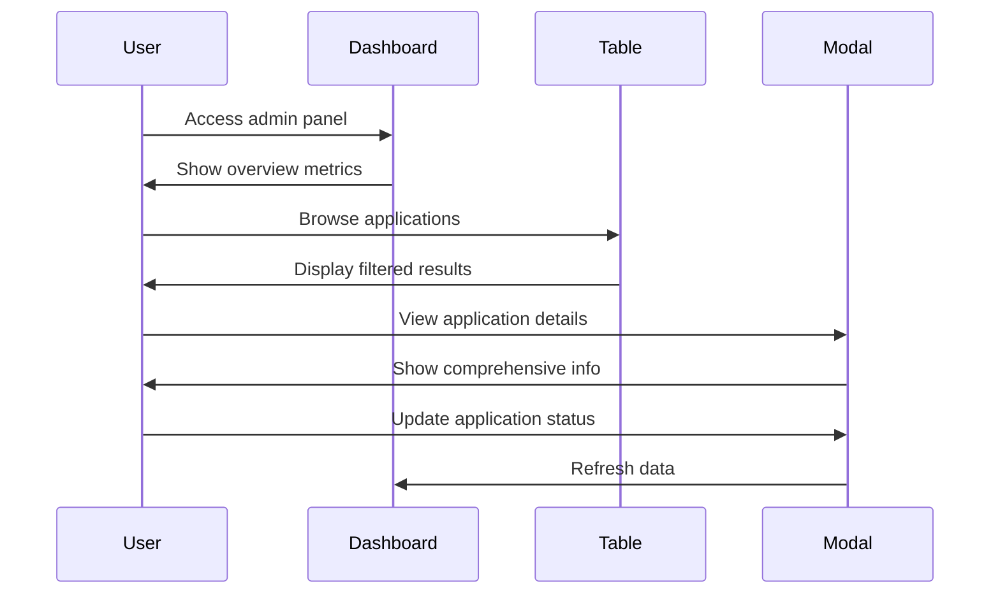

# OFAB Admin Dashboard UI Enhancement Design

## Overview

The OFAB Admin Dashboard currently serves as a functional interface for managing OMAS 2025 media award applications. This design document outlines comprehensive UI/UX improvements to transform the dashboard into a modern, intuitive, and feature-rich administrative interface that enhances productivity and user experience.

### Current State Analysis
- Basic table-driven interface with limited visual hierarchy
- Functional but dated styling approach
- Limited interactive feedback and micro-interactions
- Basic responsive design with room for improvement
- Missing advanced filtering and bulk operation capabilities

### Enhancement Objectives
- Modernize visual design with contemporary UI patterns
- Improve information architecture and data visualization
- Enhance user workflow efficiency through better interaction design
- Implement advanced filtering, sorting, and bulk operations
- Add comprehensive analytics and reporting features

## Technology Stack & Dependencies

### Current Technology Foundation
- **Frontend Framework**: React 18.2+ with JSX
- **Styling**: CSS Modules with custom styling
- **Icons**: React Icons (Font Awesome icons)
- **State Management**: React useState/useEffect hooks
- **Data Export**: xlsx library for Excel export
- **Backend Integration**: Supabase for authentication and data

### Proposed Enhancement Dependencies
- **Animation Library**: Framer Motion for smooth transitions
- **Chart Library**: Chart.js or Recharts for data visualization
- **UI Components**: Headless UI for accessible components
- **Date Handling**: date-fns for improved date formatting
- **Virtual Scrolling**: react-window for large dataset performance
- **Toast Notifications**: react-hot-toast for user feedback

## Component Architecture

### Enhanced Dashboard Structure



### Component Hierarchy Details

#### 1. Enhanced Header Component
- **UserProfile**: Admin avatar, name, and role indicator
- **NotificationCenter**: Real-time alerts and system notifications
- **QuickActions**: Frequently used actions (export, refresh, settings)
- **Search**: Global search with autocomplete and filters

#### 2. Sidebar Navigation
- **NavigationMenu**: Expandable menu with icons and badges
- **StatsSummary**: Mini analytics cards with trend indicators
- **QuickFilters**: One-click preset filters for common queries

#### 3. Main Content Areas
- **AnalyticsDashboard**: Comprehensive metrics and visualization
- **ApplicationsTable**: Enhanced data table with advanced features
- **DetailModal**: Rich application details with document preview

### Component Props & State Management

#### DashboardState Interface
```typescript
interface DashboardState {
  applications: Application[]
  filteredApplications: Application[]
  selectedApplications: string[]
  currentView: 'grid' | 'table' | 'kanban'
  filters: FilterState
  sorting: SortingState
  pagination: PaginationState
  loading: LoadingState
  notifications: Notification[]
}
```

#### Enhanced Application Data Model
```typescript
interface Application {
  id: string
  personalInfo: PersonalInfo
  professionalInfo: ProfessionalInfo
  submissions: MediaSubmission[]
  status: ApplicationStatus
  timeline: StatusHistory[]
  documents: DocumentInfo[]
  adminNotes: AdminNote[]
  metadata: ApplicationMetadata
}
```

## UI Design System

### Color Palette
```css
:root {
  /* Primary Colors */
  --primary-50: #eff6ff;
  --primary-100: #dbeafe;
  --primary-500: #3b82f6;
  --primary-600: #2563eb;
  --primary-700: #1d4ed8;
  
  /* Semantic Colors */
  --success-50: #f0fdf4;
  --success-500: #22c55e;
  --warning-50: #fffbeb;
  --warning-500: #f59e0b;
  --error-50: #fef2f2;
  --error-500: #ef4444;
  
  /* Neutral Colors */
  --gray-50: #f9fafb;
  --gray-100: #f3f4f6;
  --gray-200: #e5e7eb;
  --gray-500: #6b7280;
  --gray-700: #374151;
  --gray-900: #111827;
  
  /* Surface Colors */
  --surface-primary: rgba(255, 255, 255, 0.95);
  --surface-secondary: rgba(248, 250, 252, 0.8);
  --surface-elevated: rgba(255, 255, 255, 0.98);
}
```

### Typography Scale
- **Display**: 3rem (48px) - Dashboard title
- **Headline**: 2rem (32px) - Section headers
- **Title**: 1.5rem (24px) - Card titles
- **Body**: 1rem (16px) - Default text
- **Caption**: 0.875rem (14px) - Secondary text
- **Label**: 0.75rem (12px) - Form labels

### Spacing System
- **Base unit**: 0.25rem (4px)
- **Component spacing**: 1rem (16px)
- **Section spacing**: 2rem (32px)
- **Page margins**: 1.5rem (24px) mobile, 3rem (48px) desktop

### Border Radius
- **Small**: 6px - Buttons, badges
- **Medium**: 12px - Cards, inputs
- **Large**: 16px - Modals, containers
- **Round**: 50% - Avatars, icons

## Enhanced User Interface Components

### 1. Dashboard Layout Enhancement

#### Modern Sidebar Design


#### Features:
- **Collapsible design** with icon-only compact mode
- **Active state indicators** with subtle animations
- **Badge notifications** for pending items
- **Quick access** to most-used functions

### 2. Enhanced Data Table

#### Advanced Table Features
- **Virtual scrolling** for performance with large datasets
- **Multi-column sorting** with visual indicators
- **Inline editing** for quick status updates
- **Expandable rows** for additional details
- **Custom column configuration** with drag-and-drop reordering
- **Bulk selection** with batch operations

#### Table Layout Structure


### 3. Advanced Filtering System

#### Multi-Level Filtering
- **Quick filters** as clickable tags
- **Advanced filter builder** with AND/OR logic
- **Date range picker** with presets
- **Multi-select dropdowns** for categories
- **Text search** with field-specific options
- **Saved filter presets** for common queries

#### Filter UI Components


### 4. Analytics Dashboard

#### Comprehensive Metrics Display
- **Key Performance Indicators** with trend comparisons
- **Interactive charts** for temporal data analysis
- **Geographic distribution** maps for applicant origins
- **Category breakdown** with drill-down capabilities
- **Conversion funnels** for application lifecycle

#### Visualization Components


## Interaction Design & User Experience

### 1. Micro-interactions

#### Hover States
- **Card elevation** on mouse hover
- **Button color transitions** with timing curves
- **Icon animations** for interactive elements
- **Tooltip displays** with contextual information

#### Loading States
- **Skeleton screens** during data fetching
- **Progressive loading** for large datasets
- **Spinner animations** for actions in progress
- **Success confirmations** with visual feedback

### 2. Navigation Flow

#### User Journey Optimization


### 3. Responsive Design Strategy

#### Breakpoint System
- **Mobile**: 320px - 768px (Stacked layout)
- **Tablet**: 768px - 1024px (Hybrid layout)
- **Desktop**: 1024px+ (Full feature layout)

#### Mobile-First Adaptations
- **Collapsible sidebar** becomes bottom navigation
- **Table transforms** to card-based layout
- **Touch-optimized** button sizes and spacing
- **Simplified filtering** with modal overlays

## Performance Optimization

### 1. Data Management

#### Virtual Scrolling Implementation
- **Windowing technique** for large lists
- **Dynamic row heights** for varying content
- **Smooth scrolling** with momentum preservation
- **Buffer zones** for seamless experience

#### Caching Strategy
- **React Query** for server state management
- **Local storage** for user preferences
- **Optimistic updates** for immediate feedback
- **Background sync** for data freshness

### 2. Code Optimization

#### Component Splitting
- **Lazy loading** for route-based components
- **Dynamic imports** for large dependencies
- **Code splitting** by feature boundaries
- **Memoization** for expensive computations

#### Bundle Optimization
- **Tree shaking** for unused code elimination
- **Asset compression** and minification
- **CDN integration** for static resources
- **Service worker** for offline capabilities

## Accessibility Enhancements

### 1. Keyboard Navigation
- **Tab order** optimization for logical flow
- **Keyboard shortcuts** for power users
- **Focus indicators** with high contrast
- **Screen reader** compatibility

### 2. Visual Accessibility
- **Color contrast** meeting WCAG 2.1 AA standards
- **Font size** controls for readability
- **Dark mode** support for low-light environments
- **Motion reduction** respect for user preferences

### 3. Inclusive Design
- **Alternative text** for visual elements
- **ARIA labels** for complex interactions
- **Language support** for internationalization
- **Error messaging** with clear instructions

## Implementation Strategy

### Phase 1: Foundation (Week 1-2)
- Design system implementation
- Component library setup
- Basic layout restructuring
- Color and typography updates

### Phase 2: Core Features (Week 3-4)
- Enhanced table component
- Advanced filtering system
- Improved modal design
- Basic analytics integration

### Phase 3: Advanced Features (Week 5-6)
- Data visualization components
- Bulk operations functionality
- Performance optimizations
- Accessibility improvements

### Phase 4: Polish & Testing (Week 7-8)
- Animation and micro-interactions
- Responsive design refinement
- User testing and feedback
- Documentation and handoff

## Testing Strategy

### 1. Component Testing
- **Unit tests** for isolated components
- **Integration tests** for data flow
- **Visual regression** testing for UI consistency
- **Accessibility** testing with automated tools

### 2. User Experience Testing
- **Usability testing** with admin users
- **Performance testing** under load
- **Cross-browser** compatibility validation
- **Mobile responsiveness** verification

### 3. Quality Assurance
- **Code review** processes
- **Design review** with stakeholders
- **Security testing** for admin functions
- **Documentation** completeness check