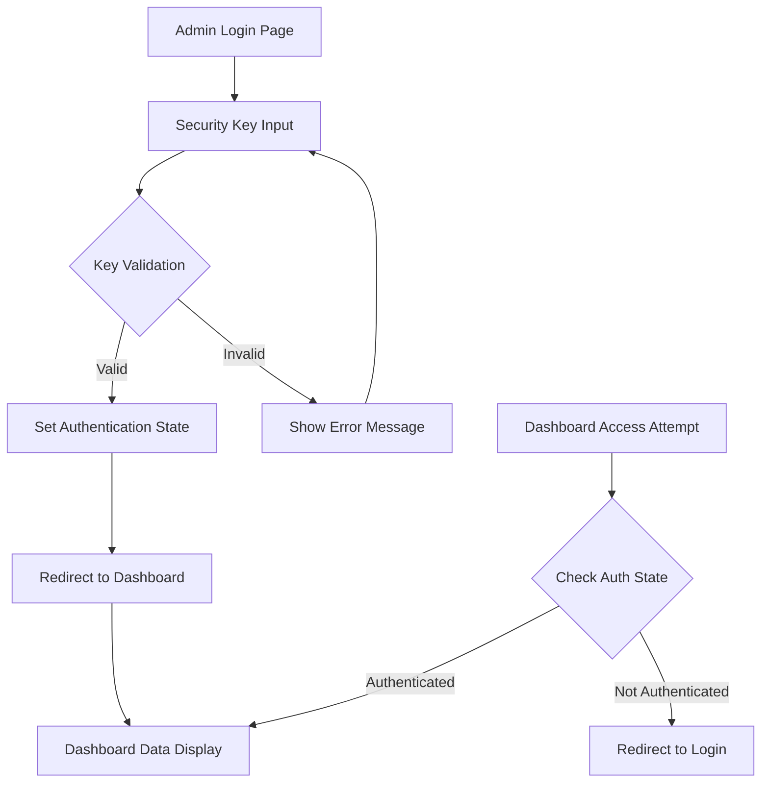
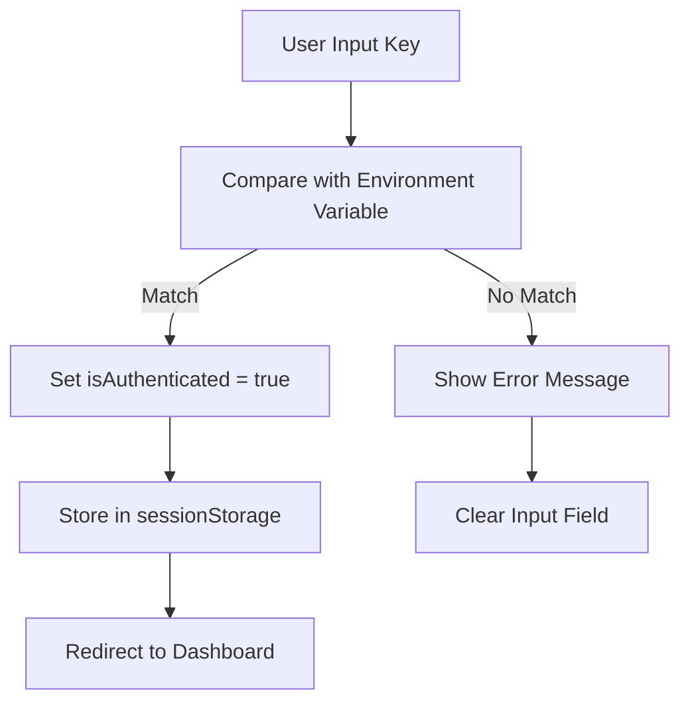
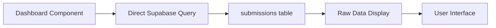
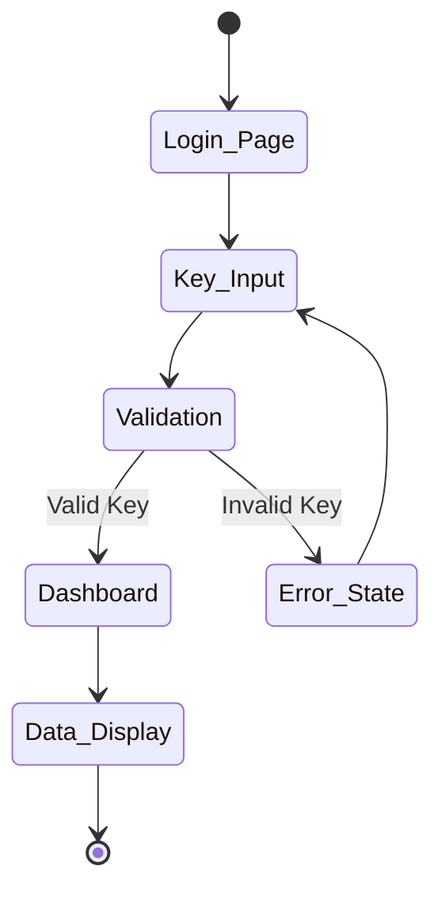

# Dashboard Token Removal and Security Key Authentication

## Overview

This design outlines the modification of the OFAB website's admin dashboard authentication system to remove complex token-based authentication (Supabase Auth) and replace it with a simple security key-based authentication mechanism. The new system will eliminate magic links, JWT tokens, and email-based authentication in favor of a straightforward security key comparison.

## Technology Stack & Dependencies

- **Frontend**: React 18.2+ with JSX
- **Build Tool**: Vite 7.0.6
- **Backend Integration**: Supabase (for data fetching only, not authentication)
- **Environment Variables**: For security key storage
- **State Management**: React useState (local component state)

## Component Architecture

### Authentication Flow Architecture



### Component Modifications Required

#### 1. AuthContext Simplification
- **Current State**: Complex Supabase JWT token management with user sessions
- **New State**: Simple boolean authentication flag with security key validation
- **Props/State Management**: 
  - `isAuthenticated`: boolean flag
  - `securityKey`: string input value
  - `login(key)`: validation function
  - `logout()`: reset authentication state

#### 2. AdminLogin Component Redesign
- **Current State**: Email input with magic link generation
- **New State**: Security key input field with immediate validation
- **Component Definition**: Single input form with validation logic
- **Lifecycle Methods/Hooks**: 
  - `useState` for key input and validation state
  - `useNavigate` for post-authentication redirect

#### 3. ProtectedRoute Simplification
- **Current State**: Complex token verification and admin role checking
- **New State**: Simple authentication state check
- **Component Hierarchy**: Direct authentication flag validation

#### 4. AdminDashboard Data Display
- **Current State**: Token-based data fetching with user context
- **New State**: Direct data fetching without authentication headers
- **Component Usage**: Remove all authentication-dependent data filtering

## Security Key Implementation

### Environment Configuration
```
VITE_ADMIN_SECURITY_KEY=your-secure-admin-key-here
```

### Validation Logic


## Data Integration Layer

### Supabase Integration Changes
- **Remove**: Authentication middleware and token headers
- **Keep**: Direct data fetching from `submissions` table
- **Modify**: Remove user/admin filtering in queries

### Data Flow Architecture


## Routing & Navigation

### Route Structure Modifications
- `/admin/login` - Security key input form
- `/admin` - Dashboard with direct data access (no protection wrapper)
- Remove `ProtectedRoute` wrapper complexity

### Navigation Flow


## State Management

### Authentication State Structure
```javascript
const authState = {
  isAuthenticated: false,
  error: null,
  loading: false
};
```

### Session Persistence
- Use `sessionStorage` for authentication state
- Clear on browser close/tab close
- No persistent tokens or cookies

## Implementation Architecture

### Modified Components

#### 1. AuthContext.jsx
- Remove Supabase auth integration
- Implement simple key validation
- Maintain authentication state in React context

#### 2. AdminLogin.jsx  
- Replace email input with security key input
- Remove magic link functionality
- Implement immediate validation on form submit

#### 3. ProtectedRoute.jsx
- Simplify to check authentication flag only
- Remove admin role verification
- Direct redirect on unauthenticated access

#### 4. AdminDashboard.jsx
- Remove user/admin context dependencies
- Implement direct data fetching
- Remove authentication-based data filtering

### Data Display Strategy

#### Registration Data Access
- **Current**: User-filtered and permission-based queries
- **New**: Direct table access with full data display
- **No Rules**: Complete access to all submission records

#### Dashboard Features
- Maintain existing UI components (tables, filters, statistics)
- Remove authentication-dependent functionality
- Keep data export and status update features

## Testing Strategy

### Component Testing
- Security key validation logic
- Authentication state management
- Data fetching without authentication
- UI component rendering with simplified state

### Integration Testing
- Login flow with security key
- Dashboard data loading
- Session persistence behavior
- Navigation between components

## Security Considerations

### Security Key Management
- Environment variable storage
- No hardcoded keys in source code
- Key rotation capability through environment updates

### Session Security
- Session-based authentication (browser session only)
- No persistent authentication storage
- Automatic logout on browser close

### Data Access Security
- Direct database access without user filtering
- Remove row-level security dependencies
- Full administrative access to all data